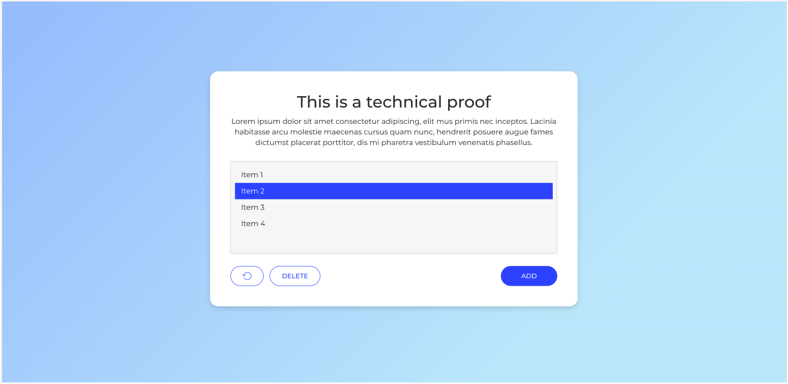
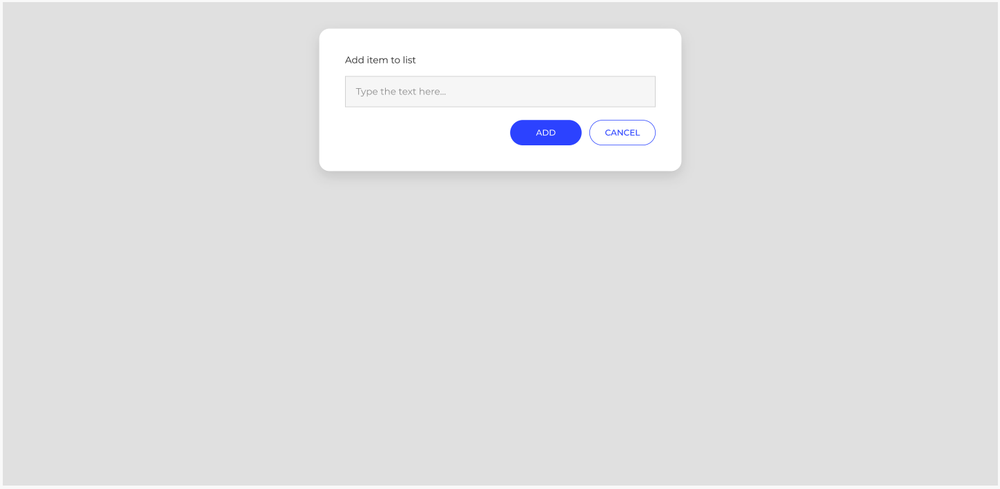
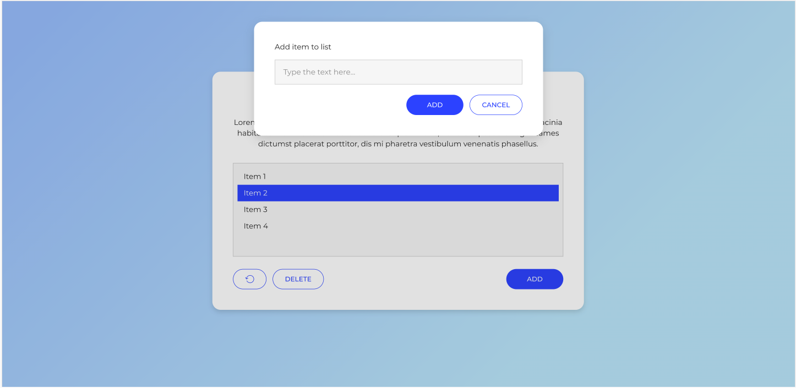

# Technical Test - Logitravel Group

Repository containing the Front-end technical test solution in two implementations:

- `technical-vanilla-js`: HTML + CSS + JavaScript Vanilla.
- `technical-react-ts`: React + TypeScript + Vite.

## Test Goal

Build an application to manage a list of text strings, meeting the following requirements:

- Add non-empty items.
- Select and delete one or multiple items.
- Allow deletion with double click (desirable).
- Allow undoing at least the last change (desirable).

Full statement available at [`documentation/technical_proof.md`](documentation/technical_proof.md).

## Repository Structure

- `technical-vanilla-js/`: Vanilla JavaScript version.
- `technical-react-ts/`: React + TypeScript version.
- `documentation/`: notes and screenshots.

## Deploy URLs

- Vanilla JavaScript: https://technical-proof-logitravel-vanilla.vercel.app/
- React + TypeScript: https://technical-proof-logitravel-react-ts.vercel.app/

## Requirements

- Node.js 20+ (recommended).
- pnpm (recommended, both projects include `pnpm-lock.yaml`).

## Run

### 1) React + TypeScript

```bash
cd technical-react-ts
pnpm install
pnpm dev
```

Application available at the URL shown by Vite (usually `http://localhost:5173`).

### 2) Vanilla JavaScript

You can open `technical-vanilla-js/index.html` directly in the browser or run a local server:

```bash
cd technical-vanilla-js
pnpm dlx servor .
```

## Tests

### React + TypeScript

```bash
cd technical-react-ts
pnpm install
pnpm test:run
```

Current result: `40` tests passing with Vitest.

### Vanilla JavaScript

```bash
cd technical-vanilla-js
pnpm install
pnpm test
```

Note: Jest currently needs a `jsdom` environment setup to run `main.test.js` correctly.

## Screenshots

### List



### Add Item



### List with Add Modal



## Additional Documentation

- Development notes: [`documentation/notes.md`](documentation/notes.md)
